# School Portal — Phase 3 Working Checkpoints

This is the short working version of `TEMP_PHASE_3_IMPLEMENTATION_GUIDE.md`.

Use it while building. The big guide remains the source of truth for security rules, edge cases and acceptance testing.

> **Rule:** finish one checkpoint, test it, then move to the next one.

---

## Phase 3 at a glance

```mermaid
flowchart LR
    A[00 Baseline + Migration 016] --> B[01 Role Context]
    B --> C[02 My Timetable + SQL 017]
    C --> D[03 Attendance DB + SQL 018]
    D --> E[04 Attendance UI]
    E --> F[05 Homework + SQL 019]
    F --> G[06 Announcements + SQL 020]
    G --> H[07 Documents Metadata + SQL 021]
    H --> I[08 Private Storage + SQL 022]
    I --> J[09 Dashboard Integration]
    J --> K[10 Full Acceptance]
```

---

# 00 — Baseline first

## Goal
Make sure Phase 2 is healthy before adding Phase 3.

## Check these existing files

| File | What it is for |
|---|---|
| `docs/RESUME.md` | Latest project checkpoint |
| `docs/PHASE_2_EXPLAINED.md` | Phase 2 history and rules |
| `package.json` | Existing scripts and packages |
| `.env.example` | Allowed environment variable names |
| `supabase/migrations/202610050016_timetable_assignment_search.sql` | Existing timetable search migration |

## Tools
- Git
- VS Code
- PowerShell / terminal
- Supabase SQL Editor
- npm

## Do this
1. Check `git status --short`.
2. Review existing uncommitted work.
3. Confirm migration `016` is applied.
4. Run:
   ```powershell
   npm run check
   ```
5. Use:
   ```powershell
   npm run dev
   ```
   when browser testing is needed.

## Done when
- Phase 2 checks pass.
- Migration 016 exists in Supabase.
- You know what existing local changes must be preserved.

---

# 01 — Role context and portal navigation

## Goal
The app must know **who the logged-in person is** and what portal mode they are allowed to use.

This is the base for every Phase 3 feature.

## Create

### `src/lib/portal-validation.ts`
**Job:** validate portal mode and child IDs.

Keep here:
- `teacher`
- `student`
- `guardian`
- selected child UUID
- safe page/date/query values

### `src/lib/portal-data.ts`
**Job:** work out the real person behind the logged-in account.

It should find:
- linked teacher
- linked student
- linked guardian
- guardian's explicitly allowed children

It must not trust IDs sent from the browser.

### `src/components/role-overview.tsx`
**Job:** show the correct starting dashboard for the selected role.

Example:
- teacher → teaching workspace
- student → learner workspace
- guardian → child workspace

### `src/components/child-selector.tsx`
**Job:** let a guardian choose one of their allowed children.

Only already-authorized children should appear.

### `tests/portal-context.test.ts`
**Job:** test:
- role validation
- linked-person resolution
- forged child IDs
- guardian access
- teacher + guardian multi-role account

## Modify

### `src/components/portal-shell.tsx`
Add role-aware navigation.

Do not expose unfinished Phase 3 links yet.

### `src/app/dashboard/page.tsx`
Read safe URL values such as:
- `mode`
- `child`
- `view`

Then render the correct panel.

## Tools
- Next.js
- TypeScript
- Zod
- Supabase server client
- Vitest

## Connection

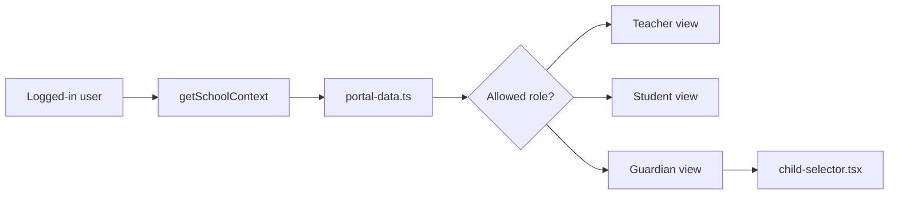

## Done when
- teacher mode works
- student mode works
- guardian mode works
- a guardian cannot request another learner by changing the URL
- multi-role accounts stay separated by selected mode

---

# 02 — My Timetable

## Goal
Teacher, student and guardian can see the timetable they are allowed to see.

This is **read-only**.

## SQL migration

### `supabase/migrations/202610050017_role_read_models.sql`

**Main job:** create narrow read functions for role-facing timetable data.

Main function:

```text
list_my_timetable(...)
```

It should return only:
- lesson ID
- weekday
- start/end time
- lesson dates
- subject
- class label
- teacher display name

It should not expose:
- teacher email
- membership IDs
- full school rosters

## Create

### `src/lib/school-date.ts`
**Job:** calculate the school's local date/week correctly.

Use the school timezone, not the user's laptop timezone.

### `src/lib/my-timetable-data.ts`
**Job:** call `list_my_timetable()` and return permitted timetable rows.

### `src/components/my-timetable-panel.tsx`
**Job:** display the timetable.

No edit or scheduling controls.

### `tests/my-timetable-database.test.ts`
**Job:** test SQL permissions and date rules.

### `tests/my-timetable.test.ts`
**Job:** test timetable rendering and bad inputs.

## Modify

### `src/app/dashboard/page.tsx`
Add:

```text
view=my-timetable
```

## How SQL connects

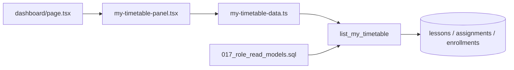

## Tools
- Supabase/PostgreSQL
- RLS
- SQL functions
- Next.js Server Components
- Vitest
- PGlite

## Done when
- teacher sees own timetable
- student sees own timetable
- guardian sees selected child's timetable
- future transfer does not expose the next class early
- changing child IDs manually does not widen access

**Checkpoint here before starting attendance.**

---

# 03 — Attendance database

## Goal
Build the attendance rules and database before building the screen.

## SQL migration

### `supabase/migrations/202610050018_attendance.sql`

This is the core attendance migration.

## Tables

### `attendance_sessions`
One register for:

```text
school + class + date
```

Main fields:
- id
- school_id
- class_id
- attendance_date
- record_version
- created_by
- timestamps

### `attendance_entries`
One student's mark inside a register.

Main fields:
- id
- school_id
- session_id
- student_id
- enrollment_id
- status
- recorded_by
- updated_at

Allowed statuses:

```text
present
absent
late
excused
```

No row means **not marked**.

## SQL functions

### `list_attendance_classes`
Shows classes the current staff member may use.

- admin → school classes
- teacher → currently assigned classes only

### `get_attendance_register`
Loads:
- the register
- version
- class roster for the selected date
- existing marks

### `save_attendance`
Saves explicit marks safely.

Must handle:
- authorization
- teacher/class ownership
- enrollment/date validation
- stale versions
- concurrent edits
- audit
- rollback on failure

### `list_my_attendance`
Used by students/guardians.

Returns only the selected learner's attendance.

## Create

### `src/lib/attendance-validation.ts`
**Job:** validate attendance input before it reaches SQL.

### `tests/attendance-database.test.ts`
**Job:** test SQL permissions, concurrency rules and school boundaries.

### `tests/attendance-validation.test.ts`
**Job:** test invalid:
- dates
- statuses
- duplicate students
- malformed batches

## SQL structure

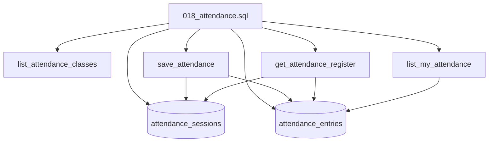

## Tools
- PostgreSQL
- Supabase RLS
- Supabase RPC
- PGlite
- Vitest
- Zod

## Done when
Database tests prove:
- admin can save
- assigned teacher can save
- unrelated teacher cannot save
- student/guardian cannot write
- School B cannot touch School A
- stale version fails
- failed save does not partly update the register

Do not build the attendance screen before this passes.

---

# 04 — Attendance UI

## Goal
Connect the working attendance database to the portal.

## Create

### `src/lib/attendance-data.ts`
**Job:** load attendance classes, registers and learner history.

### `src/app/dashboard/attendance/actions.ts`
**Job:** server action that sends validated attendance to `save_attendance()`.

### `src/app/dashboard/attendance/search-actions.ts`
**Job:** search only classes the current staff member is allowed to use.

### `src/components/attendance-panel.tsx`
**Job:** decide which attendance screen to show.

Staff:
- choose class/date
- load register

Student/guardian:
- read-only attendance history

### `src/components/attendance-form.tsx`
**Job:** mark:
- present
- absent
- late
- excused

Only intentionally marked rows should be submitted.

### `tests/attendance-actions.test.ts`
Tests server-action behaviour.

### `tests/attendance-form.test.ts`
Tests the form and empty/error states.

## Modify
- `src/app/dashboard/page.tsx`
- `src/components/portal-shell.tsx`

Add the attendance route/view only when it works.

## Connection

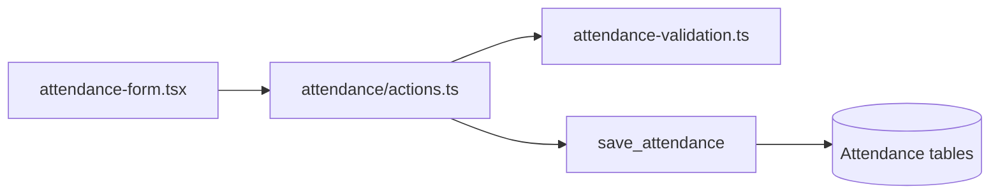

## Tools
- React
- Next.js Server Actions
- `useActionState`
- Zod
- Supabase RPC

## Done when
- staff can mark attendance
- old form/version conflict is handled safely
- unmarked learners stay unmarked
- learners/guardians get a separate read-only history view

---

# 05 — Homework

## Goal
Teachers/admin create homework. Students/guardians read published homework.

No submissions or grading in Phase 3.

## SQL migration

### `supabase/migrations/202610050019_homework.sql`

## Main table

### `homework_items`

Important ideas:
- teaching assignment
- class
- academic year
- title
- instructions
- due date
- draft / published / withdrawn
- audience date
- author
- version

## Main SQL work

Create:
- save/create/update/publish/withdraw logic
- list/read logic
- authorized assignment search for teachers if needed

Important:
A teacher who wrote homework earlier does not keep permanent edit rights after losing the assignment.

## Create

- `src/lib/homework-validation.ts` — validates homework input
- `src/lib/homework-data.ts` — loads homework
- `src/app/dashboard/homework/actions.ts` — saves/publishes/withdraws
- `src/app/dashboard/homework/search-actions.ts` — teacher assignment selector if needed
- `src/components/homework-panel.tsx` — lists homework
- `src/components/homework-form.tsx` — staff editor
- `tests/homework-database.test.ts`
- `tests/homework-actions.test.ts`
- `tests/homework-validation.test.ts`

## Connection

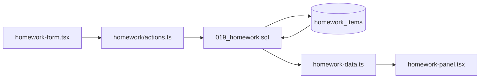

## Tools
- Supabase/PostgreSQL
- RLS
- Next.js Server Actions
- Zod
- React
- Vitest

## Done when
- teacher/admin can create draft
- permitted teacher/admin can publish
- students/guardians see only allowed published work
- withdrawn/draft work is hidden from recipients
- no submission feature exists

---

# 06 — Announcements

## Goal
Add announcements inside the portal.

No email, SMS, WhatsApp or n8n in this phase.

## SQL migration

### `supabase/migrations/202610050020_announcements.sql`

## Main table

### `announcements`

Important fields:
- school
- title
- body
- author
- draft / published / withdrawn
- audience
- audience date
- optional expiry
- version

Simple first version:
- whole school
- OR one class

## Create

- `src/lib/announcement-validation.ts` — validates announcement input
- `src/lib/announcement-data.ts` — loads allowed announcements
- `src/app/dashboard/announcements/actions.ts` — create/edit/publish/withdraw
- `src/components/announcements-panel.tsx` — announcement feed
- `src/components/announcement-form.tsx` — staff editor
- `tests/announcements-database.test.ts`
- `tests/announcements-actions.test.ts`

## Connection

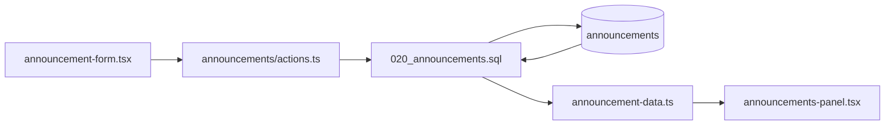

## Tools
- PostgreSQL
- Supabase RLS
- Next.js
- React
- Vitest

## Done when
- admin can publish school notices
- teacher can publish only under the accepted class rule
- students/guardians see only intended notices
- expired/draft/withdrawn items stay hidden

---

# 07 — Document metadata

## Goal
Create the database side of private PDF documents before dealing with Storage.

## SQL migration

### `supabase/migrations/202610050021_document_metadata.sql`

## Main table

### `documents`

Each PDF record stores information such as:
- id
- school
- storage path
- original filename
- MIME type
- size
- uploader
- state
- parent item

One document belongs to exactly one:
- homework item
- announcement
- class resource

Suggested states:
- pending
- ready
- deleting
- deleted
- failed

## SQL functions

### `begin_document_upload`
Checks permission and creates a pending document record/path.

### `finish_document_upload`
Marks upload ready after the file was successfully stored.

### `begin_document_delete`
Stops normal reads and starts deletion.

### `finish_document_delete`
Records successful physical deletion.

### `list_documents`
Returns only files the caller may see.

## Create

### `src/lib/document-validation.ts`
**Job:** document validation and constants.

Examples:
- bucket name
- max PDF bytes
- IDs
- metadata rules

### `src/lib/document-files.ts`
**Job:** server-only file checks.

Examples:
- PDF header check
- safe download filename

### `src/lib/document-data.ts`
**Job:** load authorized document metadata.

## Connection

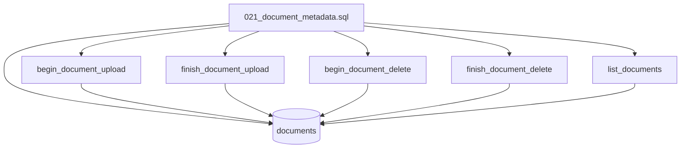

## Tools
- PostgreSQL
- Supabase
- Zod
- server-only TypeScript helpers

## Done when
Metadata permissions work before actual Storage upload is connected.

---

# 08 — Private PDF Storage

## Goal
Store real PDFs privately and serve them only through authenticated portal requests.

## SQL migration

### `supabase/migrations/202610050022_document_storage.sql`

## What this migration does
Configure private Supabase Storage:

```text
bucket: school-documents
```

Rules:
- private
- PDF only
- 2 MiB maximum
- authenticated access only through narrow policies

Storage policies should control:
- INSERT
- SELECT
- DELETE

Do not allow general authenticated bucket access.

Do not use UPDATE initially.

## Modify

### `next.config.ts`
Add a roughly 3 MB Server Action request allowance so the 2 MiB PDF policy has multipart overhead.

Do not replace the rest of the config.

## Create

### `src/app/dashboard/documents/actions.ts`
**Job:** upload and delete workflow.

Order:

```text
validate
→ begin_document_upload
→ upload bytes
→ finish_document_upload
```

### `src/components/documents-panel.tsx`
**Job:** show allowed documents.

### `src/components/document-upload-form.tsx`
**Job:** staff PDF chooser/upload form.

### `src/app/dashboard/documents/[id]/download/route.ts`
**Job:** authenticated PDF download.

It must:
- check user context
- verify document permission
- download through the user-context Supabase client
- return private/no-store response
- use safe attachment filename

### Tests
- `tests/documents-database.test.ts`
- `tests/documents-actions.test.ts`
- `tests/document-files.test.ts`
- `tests/document-download.test.ts`

If full migration tests need Supabase Storage objects in PGlite, add the guide's small test-only Storage fixture helper.

## Full document flow

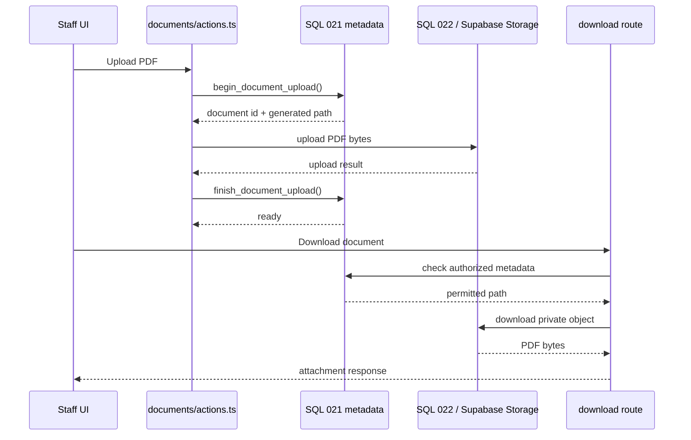

## Modify later
- `src/components/homework-panel.tsx`
- `src/components/announcements-panel.tsx`

Add attachment links only after both metadata and Storage permissions work.

## Tools
- Supabase Storage
- Supabase RLS
- Next.js Server Actions
- Next.js Route Handlers
- `File`
- `Uint8Array`
- `Response`
- Vitest

## Done when
- authorized staff upload PDF
- student/guardian cannot upload
- permitted recipients download
- guessed School B paths fail
- draft/unready files stay hidden
- failed upload/finalize/delete states are recoverable

---

# 09 — Dashboard integration

## Goal
Bring the finished modules together.

Do not create weaker duplicate queries just to make dashboard cards.

## Modify

### `src/components/role-overview.tsx`
Show useful information from the completed modules.

### Optional: `src/lib/dashboard-data.ts`
Use only if a small server-side loader helps combine existing feature reads.

## Suggested dashboard

### Admin
- attendance progress
- operational links
- published notices

### Teacher
- today's timetable
- attendance shortcuts
- homework
- announcements

### Student
- timetable
- homework
- announcements
- own attendance summary

### Guardian
- child selector
- child's timetable
- homework
- attendance

## Connection

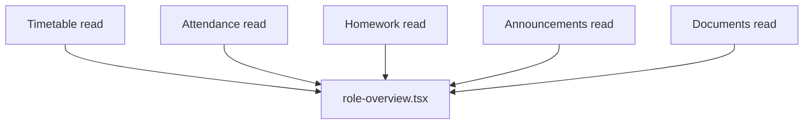

## Done when
The dashboard reuses the same permission rules as the real feature pages.

---

# 10 — Full acceptance

## Local commands

```powershell
npm run check
npm run test:e2e
```

Use targeted tests while building, then run the full suite.

## Database checks
Confirm:
- every new public table has RLS
- school boundaries work
- direct writes are denied where RPCs are required
- public/anonymous function execution is revoked where needed
- privileged functions pin `search_path`
- stale versions fail safely
- Storage policies work with real file operations

## Browser accounts to test

Use fictional accounts for:
- School A admin
- Teacher A
- Teacher B
- Student A
- Student B
- guardian with access
- guardian without access
- teacher + guardian multi-role
- suspended account
- unlinked account
- School B accounts

## Final feature checklist

```text
[ ] Role context
[ ] My Timetable
[ ] Attendance DB
[ ] Attendance UI
[ ] Homework
[ ] Announcements
[ ] Document metadata
[ ] Private PDF Storage
[ ] Dashboard integration
[ ] Full tests
```

---

# Coding structure to keep consistent

Use the same pattern for every module.

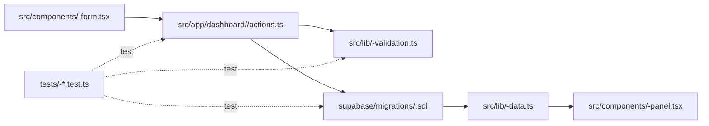

## What each file type means

### `*-validation.ts`
Checks that input has the right shape.

It does **not** decide whether the user has permission.

### `*-data.ts`
Server-only reading.

Gets already-authorized data from Supabase.

### `actions.ts`
Handles create/update/delete actions from the UI.

Usually:
1. check context
2. validate input
3. call SQL RPC
4. return safe success/error message
5. revalidate the page

### `*-panel.tsx`
Main display component.

Usually server-rendered.

### `*-form.tsx`
Interactive client form.

It collects input but does not decide authorization.

### SQL migration
The real database rules live here.

It handles:
- tables
- constraints
- RLS
- SQL functions
- permissions
- concurrency/version rules
- school boundaries

### Tests
Prove that both success and denial paths behave correctly.

---

# SQL migration map

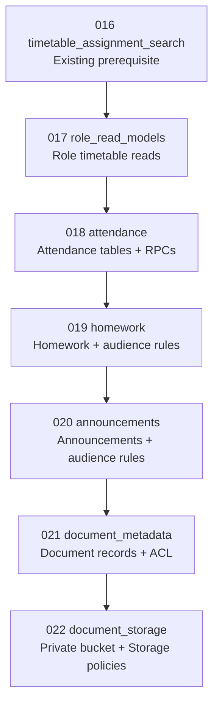

> If these migration numbers have already been used by the time you implement them, use the next available migration number. Never edit an already-applied migration.

---

# Recommended work order

Do not create everything at once.

## Build block 1
```text
01 Role context
02 My Timetable
```

Then stop and test.

## Build block 2
```text
03 Attendance DB
04 Attendance UI
```

Then stop and test.

## Build block 3
```text
05 Homework
06 Announcements
```

Then stop and test.

## Build block 4
```text
07 Document metadata
08 Private PDF Storage
```

Then stop and test.

## Build block 5
```text
09 Dashboard integration
10 Full acceptance
```

---

# Checkpoint report to use after each block

```text
School Portal — Phase 3 checkpoint

Checkpoint completed:
Current unfinished task:

New files:
Modified files:
SQL migration applied:

Tests run:
Results:

Browser/security checks completed:

Problems / deferred checks:

Git commit:

Next checkpoint:
```

Keep credentials, real learner information and real passwords out of this report.
