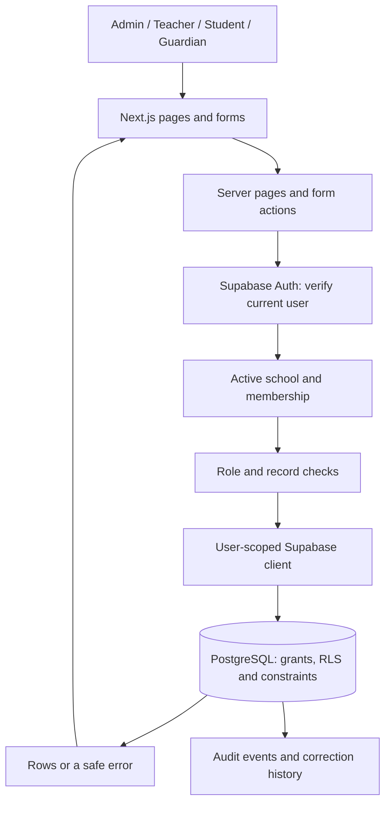

# How School Portal fits together

Updated 4 October 2026. This describes what is built today. The agreed stack and one-school-first plan have not changed.

## A request from start to finish

Next.js serves the UI and handles backend work. We do not have a separate Express API server. Read queries are made by server-rendered panels; form submissions go through server actions. Shared validation and identity checks live in `src/lib`. More complex operations call PostgreSQL functions, also called RPCs.

For example, a transfer is not two independent saves from the browser. The server validates the request and calls a database function that closes the old enrollment, creates the replacement and records the audit event together. If part of that operation fails, it should not leave half a transfer behind.

## Who can do what

Supabase Auth proves which account is signed in. A membership connects that account to this school; its roles determine permitted actions. The server checks that the school and membership are active. The database checks access again through RLS, or row-level security.

`SCHOOL_PORTAL_SCHOOL_ID` tells this installation which school to open. It does not give anyone permission. Editable user metadata, a role selector or a URL parameter cannot grant access. Normal app requests use the signed-in user's database context, not a service-role key.

The working screens are currently admin-focused. Teachers, students and guardians have database read rules, but their dedicated record screens are still ahead.

- A linked teacher can read their own assignments and lessons, plus current classes and learners allowed by dated teaching/enrollment relationships.
- A linked student can read their own permitted records and enrollment history; timetable access follows the relevant current placement.
- A linked guardian also needs an explicit child-access grant. A family relationship by itself is not authorization.
- School Admin manages the school's records. This is not a platform-owner role.

See [LOGIN_LINKS.md](LOGIN_LINKS.md) for the exact read boundaries and [FILE_GUIDE.md](FILE_GUIDE.md) for where the checks live.

## The data model

| Part | Why it exists |
| --- | --- |
| `schools` | School identity, timezone and active state. |
| Auth users and `profiles` | Login identity and a global display profile. A profile is not a learner record. |
| `school_memberships`, `membership_roles` | The account's relationship with a school, status and one or more roles. |
| Academic years, terms, grades, subjects, classes | The school structure. Classes belong to a year and grade. |
| Students, teachers, guardians | School-owned records that can exist before a login is linked. |
| `student_guardians` | Family relationships and the separate child-access permission. |
| `enrollments` | Dated placements, including retained transfer/withdrawal history. |
| `teaching_assignments`, `timetable_lessons` | Teaching responsibilities and weekly lesson schedules. |
| `school_invitations` | Pending access offers and delivery state; a pending invitation is not membership. |
| `audit_events`, `record_history` | An append-only activity trail and restricted previous versions of corrected records. |

School-owned relationships use school-matching foreign keys as well as RLS. Profiles are deliberately global: one login might eventually join more than one school. This does not mean school records should be global.

SQL migrations are the database change history. Migrations 001–014 exist; the user has confirmed applying 009–014 to the dedicated project. Migration 014 adds versioned assignment end/replacement with history and timetable date protection. Do not edit or rerun an applied migration to fix a new issue. Add a follow-up, as we did with 013 and 014.

Academic setup reads 50 records per list, plus one lookahead to decide whether to offer the next page. Each list uses its own validated URL parameter, with name and ID ordering. Visible class/term labels use school-scoped ID lookups. Year and grade form choices are searched on demand instead of preloading a capped list. These reads use the existing user-context Supabase client and RLS; pagination changes no permissions. Offset pages reflect current data, so a concurrent rename or creation may move a row between pages.

School registers uses the same page validation and URL-building helper. Its server-only `register-data.ts` loads the five visible pages and resolves only their current membership IDs. Sign-in choices use the admin-only `search_register_members` RPC from migration 015; role and ownership eligibility are applied before pagination. No complete people/account lists are needed. Guardian relationships and enrollments use on-demand searches; class/year/grade labels for visible enrollments are fetched by school-scoped ID lookups instead of loading full catalogs. A paged list is never treated as a complete set of people or linked accounts.

`planning-data.ts` uses the same user client and school-scoped reads for teaching assignments and timetable lessons. Timetable filtering is a validated URL parameter applied before the database range. Teaching and timetable choices are searched on demand, so page loads fetch only labels needed by displayed assignments/lessons and the active filter. Missing labels are fetched in batches of at most 100 IDs. Database conflict checks, locks and permissions are unchanged.

`dashboard/search/actions.ts` is a read-only Server Action, but still verifies the active School Admin context on every call. Its allowlisted input accepts a record category, short search text, bounded page number and optional excluded record ID. It does not accept a school ID. It uses the user's Supabase client, school filters and RLS, returns at most 25 choices plus a next-page flag, and supplies class year/date details through separately scoped reads. Percent, underscore and backslash are escaped for literal ILIKE matching. Save actions independently validate the submitted IDs; search results are not an authorization token. `record-search-select.tsx` keeps selected choices separate from search results and ignores superseded responses. No new API route or elevated application credential is needed. Basic record searches use existing tables; account and timetable search use migrations 015 and 016 respectively.

Student and guardian searches return names and school references only. Class searches may also accept a validated academic-year ID, used by enrollment transfers to narrow destinations before paging. This filter only narrows school-scoped reads; the enrollment save independently enforces the original year and all relationship/date rules. Withdrawal unmounts the destination selector, so it submits no transfer destination.

## Sessions, scripts and the public preview

The request proxy refreshes session cookies and adds a fresh script-security nonce. User pages are rendered per request, with private/no-store behavior. Security headers reduce unwanted embedding and browser access to unused capabilities.

`/preview` uses hardcoded planning content only. It does not query school data or offer an authorization bypass. Planned modules shown there are not evidence of working modules.

## Email and other services

Invitation preparation is built. The separate Supabase Edge Function for sending invitations has its own runtime boundary; privileged Auth credentials belong there, never in the Next.js app. The function checks the caller, claims an authorized invitation and records delivery outcomes. Membership acceptance still happens through controlled database logic.

Delivery remains disabled and unverified. Saved SMTP settings are not enough while the sending domain is unregistered. Password recovery also needs a working delivery path before live use.

Private PDF storage, document metadata, notifications, n8n and AI are future work. There is no working upload route, storage bucket workflow or notification queue to document yet. Results will need review and School Admin publication states in Phase 4. School selection, SaaS billing and platform administration remain later decisions.

## What the tests establish

The local database suites execute SQL in PGlite with fictional schools and simulated Auth identities. They test actual database rules, but not the hosted gateway, issued tokens, independent concurrent sessions or email delivery. Browser tests use a disconnected app; hosted verification uses the dedicated fictional-data project.

The migration 013 issue showed why this distinction matters: the earlier local Auth fixture used the wrong email column type. That fixture is now corrected in the relevant final-schema tests. See [tests/README.md](../tests/README.md) and [VERIFICATION.md](VERIFICATION.md) for results and limits.

Timetable choice search uses `search_timetable_assignments` (migration 016), an admin-checked, security-invoker read with the caller's RLS. Teacher/reference, subject, class, grade and year matching happens before bounded pagination. `planning-data.ts` no longer preloads choice catalogs: it resolves only visible assignment/lesson references and the active filter. Neither search nor paging changes lesson conflict or lifecycle rules. Migration 015 is user-confirmed applied; 016 still needs hosted application.
