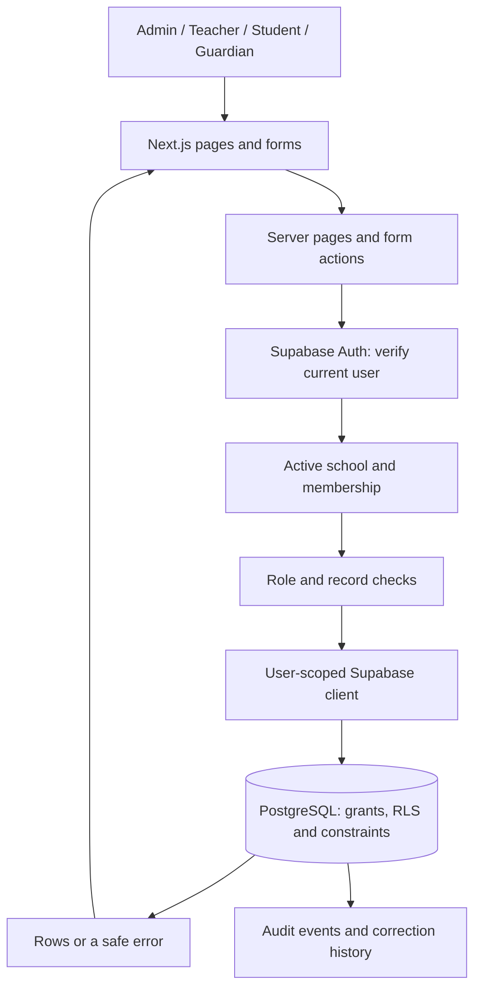

# How School Portal fits together

Updated 4 October 2026. This describes what is built today. The agreed stack and one-school-first plan have not changed.

## A request from start to finish

Next.js serves the UI and handles backend work. We do not have a separate Express API server. Read queries are made by server-rendered panels; form submissions go through server actions. Shared validation and identity checks live in `src/lib`. More complex operations call PostgreSQL functions, also called RPCs.

For example, a transfer is not two independent saves from the browser. The server validates the request and calls a database function that closes the old enrollment, creates the replacement and records the audit event together. If part of that operation fails, it should not leave half a transfer behind.

## Who can do what

Supabase Auth proves which account is signed in. A membership connects that account to this school; its roles determine permitted actions. The server checks that the school and membership are active. The database checks access again through RLS, or row-level security.

`SCHOOL_PORTAL_SCHOOL_ID` tells this installation which school to open. It does not give anyone permission. Editable user metadata, a role selector or a URL parameter cannot grant access. Normal app requests use the signed-in user's database context, not a service-role key.

The working screens are currently admin-focused. Teachers, students and guardians have database read rules, but their dedicated record screens are still ahead.

- A linked teacher can read their own assignments and lessons, plus current classes and learners allowed by dated teaching/enrollment relationships.
- A linked student can read their own permitted records and enrollment history; timetable access follows the relevant current placement.
- A linked guardian also needs an explicit child-access grant. A family relationship by itself is not authorization.
- School Admin manages the school's records. This is not a platform-owner role.

See [LOGIN_LINKS.md](LOGIN_LINKS.md) for the exact read boundaries and [FILE_GUIDE.md](FILE_GUIDE.md) for where the checks live.

## The data model

| Part | Why it exists |
| --- | --- |
| `schools` | School identity, timezone and active state. |
| Auth users and `profiles` | Login identity and a global display profile. A profile is not a learner record. |
| `school_memberships`, `membership_roles` | The account's relationship with a school, status and one or more roles. |
| Academic years, terms, grades, subjects, classes | The school structure. Classes belong to a year and grade. |
| Students, teachers, guardians | School-owned records that can exist before a login is linked. |
| `student_guardians` | Family relationships and the separate child-access permission. |
| `enrollments` | Dated placements, including retained transfer/withdrawal history. |
| `teaching_assignments`, `timetable_lessons` | Teaching responsibilities and weekly lesson schedules. |
| `school_invitations` | Pending access offers and delivery state; a pending invitation is not membership. |
| `audit_events`, `record_history` | An append-only activity trail and restricted previous versions of corrected records. |

School-owned relationships use school-matching foreign keys as well as RLS. Profiles are deliberately global: one login might eventually join more than one school. This does not mean school records should be global.

SQL migrations are the database change history. Migrations 001–013 exist; the user has confirmed applying 009–013 to the dedicated project. Do not edit or rerun an applied migration to fix a new issue. Add a follow-up, as we did with 013.

## Sessions, scripts and the public preview

The request proxy refreshes session cookies and adds a fresh script-security nonce. User pages are rendered per request, with private/no-store behavior. Security headers reduce unwanted embedding and browser access to unused capabilities.

`/preview` uses hardcoded planning content only. It does not query school data or offer an authorization bypass. Planned modules shown there are not evidence of working modules.

## Email and other services

Invitation preparation is built. The separate Supabase Edge Function for sending invitations has its own runtime boundary; privileged Auth credentials belong there, never in the Next.js app. The function checks the caller, claims an authorized invitation and records delivery outcomes. Membership acceptance still happens through controlled database logic.

Delivery remains disabled and unverified. Saved SMTP settings are not enough while the sending domain is unregistered. Password recovery also needs a working delivery path before live use.

Private PDF storage, document metadata, notifications, n8n and AI are future work. There is no working upload route, storage bucket workflow or notification queue to document yet. Results will need review and School Admin publication states in Phase 4. School selection, SaaS billing and platform administration remain later decisions.

## What the tests establish

The local database suites execute SQL in PGlite with fictional schools and simulated Auth identities. They test actual database rules, but not the hosted gateway, issued tokens, independent concurrent sessions or email delivery. Browser tests use a disconnected app; hosted verification uses the dedicated fictional-data project.

The migration 013 issue showed why this distinction matters: the earlier local Auth fixture used the wrong email column type. That fixture is now corrected in the relevant final-schema tests. See [tests/README.md](../tests/README.md) and [VERIFICATION.md](VERIFICATION.md) for results and limits.
