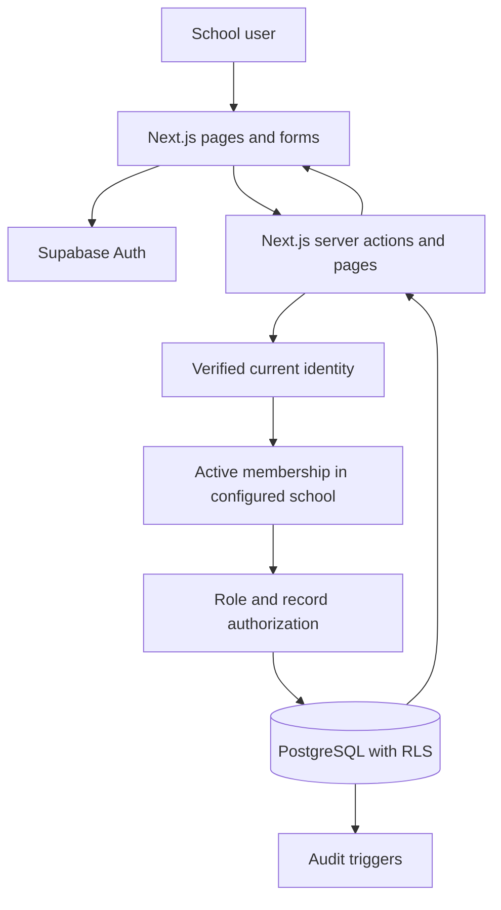

# Foundation architecture

## Preview boundary

`/preview` renders hardcoded product planning content only. It does not create a Supabase client or load database records. It is available with or without configuration. No preview role, query string or browser value can change authentication. Unknown preview views fall back to the overview.

## Identity and school context

`SCHOOL_PORTAL_SCHOOL_ID` is a server-side context for the first school, not authorization. The server verifies the current user with Supabase, then requests active membership for both the verified user ID and configured school ID. The database independently checks the authenticated identity. Disabled schools and suspended memberships fail closed. Role claims from editable user metadata are never used.

User-specific pages are dynamically rendered. The auth proxy refreshes cookies and sends private/no-store headers. Normal database requests use the authenticated user's permissions, never an elevated service key.

## Foundation schema

- `schools`: school ID, name, timezone, active state.
- `profiles`: global account profile, keyed by the Supabase Auth user ID. Not a learner record.
- `school_memberships`: school/account relationship, with active or suspended state.
- `membership_roles`: multiple roles, attached using a composite membership/school foreign key.
- `audit_events`: school, actor UUID, operation, target and timestamp. This initial audit records operation identity, not complete before/after history; expand deliberately for marks, finance and support workflows.

Profiles are an intentional exception to `school_id`: a login identity may eventually belong to multiple schools. School-specific attributes should go on school-owned records in later migrations.

## Database permissions

- Anonymous users cannot read foundation tables.
- Active members can read their school and their own membership/roles.
- School admins can read memberships/roles and audit events within their school.
- Only an active school admin can update the school's name and timezone. Column grants prevent changes to school ID or active status.
- Profiles can only be read/renamed by their own account in this milestone.
- Direct table provisioning remains denied. After the second migration, active School Admins use scoped RPCs for role/status edits and pending invitations. A school-row lock serializes changes; versions reject stale edits and the final active admin cannot be removed. Recipient acceptance derives the verified email from Auth and never overwrites existing memberships.
- Audit rows are inserted by triggers and cannot be edited/deleted by application users.
- `private` functions are narrowly scoped policy helpers. Keep that schema outside Supabase's exposed API schemas.

## Test boundaries

The database suite executes the actual migration in PGlite, a PostgreSQL engine compiled for local execution. It creates simulated Supabase roles and an `auth.uid()` boundary. It tests real SQL RLS, grants, foreign keys and audit triggers.

This does not test the hosted Supabase gateway, token issuance, cookie behaviour, email, Storage or deployment. Those require the dedicated project and connected integration checks. Future modules need additional teacher-assignment and guardian-link checks; membership alone is not sufficient.

## Later architecture

Account-management additions are documented in ACCOUNT_MANAGEMENT.md. Next.js never carries privileged Auth credentials. A separate Supabase-hosted email function verifies the caller, claims an authorized pending invitation, and uses only its runtime credential to request an Auth invitation. Acceptance and school permissions stay in database-controlled RPCs. Password recovery and acceptance use fixed destinations and a POST token-confirmation step. Email delivery is disabled until configured and is not yet live-tested.

Private PDF storage and file ownership metadata arrive with the document module. Results require entry, review and admin publication states. Notification jobs should be created with committed events and retried independently of user-facing saves. Platform administration, school selection and provisioning come only when another real school is onboarded.

Reference used for session wiring: [Supabase server-side clients](https://supabase.com/docs/guides/auth/server-side/creating-a-client?queryGroups=framework&framework=nextjs).
