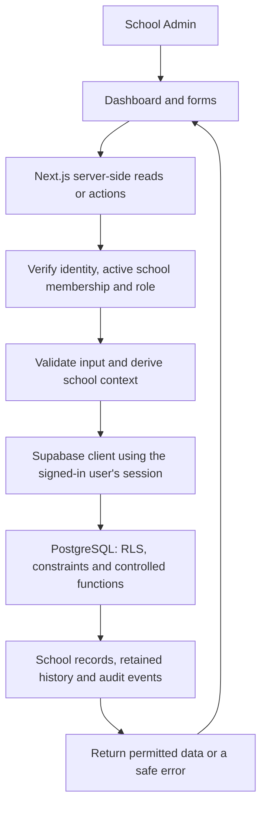
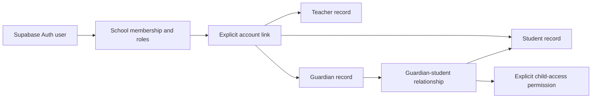
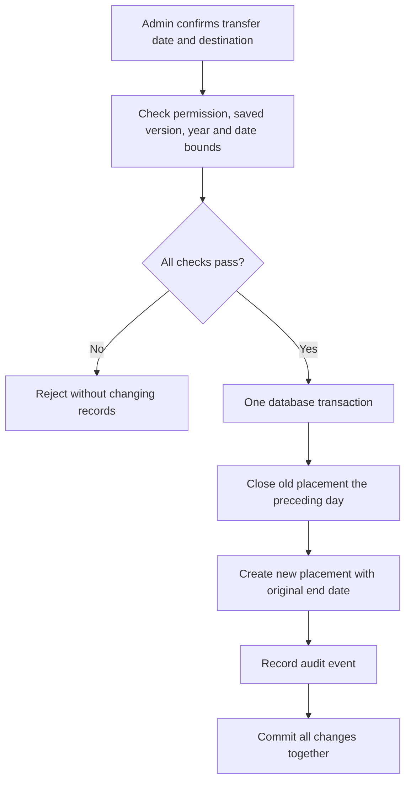
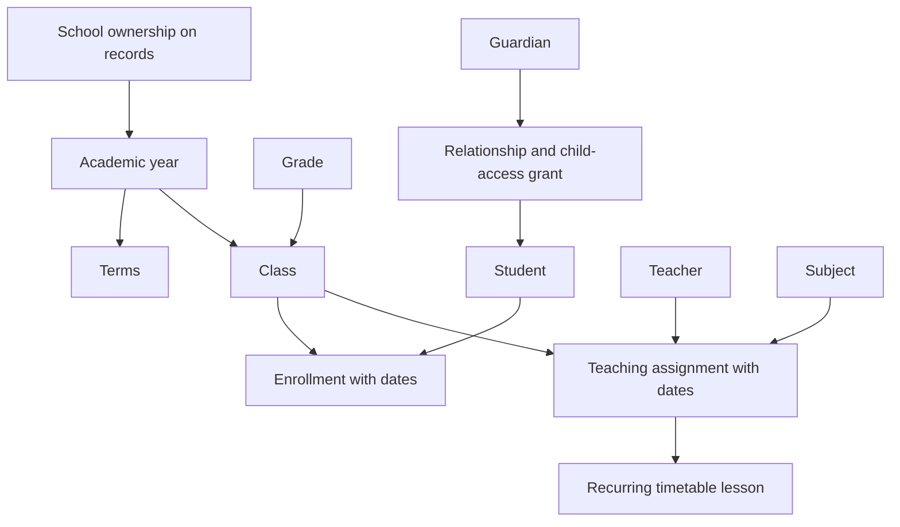
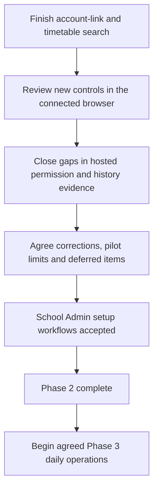

# School Portal: Phase 2 explained

Status reviewed on **5 October 2026**.

> Later update on 5 October: account-link search is implemented and migration 015 application is user-confirmed. Timetable search is also implemented locally; new migration 016 still needs hosted application. Browser checks remain on hold. The detailed explanation below records the earlier checkpoint, so its unfinished search items describe that earlier state. See [the current resume notes](RESUME.md) for the latest handover.

This document brings the Phase 2 work into one place: what I built, why it was needed, how the pieces connect, and what remains before we can call this phase complete. It describes the current project, rather than proposing a new architecture.

**We are still in Phase 2 — Academic Setup.** The main admin workflows are implemented. The remaining development is mainly searchable account-linking and timetable choices, followed by the remaining acceptance checks and a decision about the correction workflows the first school needs. Passing local tests does not, by itself, close the phase.

You have confirmed applying migration 014 and completing the earlier pending tests with fictional records. That work counts. The newer search and pagination controls still need the browser checks you said you would handle. Detailed evidence of hosted security and simultaneous changes is a separate item.

## 1. What Phase 2 was meant to achieve

The original scope was students, teachers, grades, classes, subjects, guardian links and basic timetables. In practical terms, an administrator should be able to answer:

- Who attends this school, and who teaches here?
- Which academic year, grade and class does each learner belong to?
- Which subjects does each teacher teach, to which classes, and during which dates?
- Which guardians are linked to a learner, and which are allowed to see that learner's information?
- When are classes scheduled, and does the timetable contain clashes?

Academic years, enrollment dates and teaching history support those answers. They are part of making academic setup reliable. Attendance, marks and fees are still later-phase work.

The design remains **one school first, with school ownership built in**. We have not added a platform-owner dashboard, subscriptions or automated school onboarding.

## 2. How the implementation connects

The application uses Next.js, TypeScript and Tailwind. Supabase provides authentication and PostgreSQL. File storage is part of the agreed architecture, but school document uploads are not a completed Phase 2 feature.

RLS means **row-level security**: database rules governing which records a signed-in person may access. A hidden button is not a security boundary. The server verifies the caller, and the database independently enforces the relevant school and role rules.

Sensitive changes use controlled database functions, also called RPCs. Some run with defined database privileges, but they check the caller's authority before making changes. The application does not use an elevated Supabase key to bypass normal user access.

## 3. What I built, and why

### Academic years, terms, grades, subjects and classes

Academic setup now supports creating and listing these records, with school ownership and validation of their relationships. Classes belong to a grade and an academic year; terms belong within their year's dates.

**Why:** a class name such as “10A” can recur in different years. Keeping the year as a separate relationship avoids confusing this year's class with last year's history. Terms and date bounds also give later attendance, assessments and reports a consistent academic calendar.

I replaced confusing generic labels with labels such as **Grade name**, **Subject name** and **Class name**. Grade names are normalized so variations such as `Grade10` and `Grade 10` do not create separate versions of the same grade. Custom grade labels remain possible; normalization should not guess what an unrelated label means.

The earlier duplicate Grade 10 test-data repair preserved the valid class and its enrollment and teaching links. That record-specific repair is archived as history. It is not a script to rerun routinely.

**Current limit:** the correction interface supports agreed name fields. It is not a general editor for changing academic dates, moving classes between grades or rewriting year relationships.

### Student, teacher and guardian registers

School registers now hold student, teacher and guardian records, including their names and school references. These records can exist before someone receives a portal account.

**Why:** the school register describes people. Authentication describes who can sign in. Treating them as the same thing would make it difficult to register a learner without an email address, record a guardian without portal access, or retain history after access is removed.

Creating a register record therefore does **not** create a login, grant a role or send an email.

### Guardian relationships and account links

A learner can have more than one guardian, and a guardian can be linked to more than one learner. A relationship record does not automatically grant access: child access must be explicitly enabled.

Person records can also be deliberately linked to school memberships. The membership must belong to the same school and have the matching role. Multiple membership roles are supported, but a membership cannot be reused for several different people of the same record type.

**Why:** knowing that someone is listed as a guardian is different from authorizing their account to see a child's information. Keeping that distinction explicit prevents accidental disclosure.

This is a conceptual diagram. One person does not need all three record types. The important distinction is between a sign-in identity, school membership and the school's person records.

Account-link and guardian-access changes include confirmation, version checks and audit records. Changing a link does not silently provision a new account.

### Enrollment, transfers and withdrawals

An enrollment records a student's class placement for a date range. The admin can transfer a student to another class in the same year or record a withdrawal while preserving the earlier placement.

For example, suppose a fictional learner is enrolled in 10A from 1 January to 31 December. A transfer to 10B starting on 1 July produces two records:

| Placement | Dates |
| --- | --- |
| Original 10A enrollment | 1 January–30 June |
| New 10B enrollment | 1 July–31 December |

**Why:** simply replacing the class ID would make the old class disappear from the student's history. Later attendance and reporting would then have the wrong context.

The database rejects overlapping placements and multiple unclosed placements for the same learner and year. Withdrawal dates include the learner's last enrolled day. Re-entry must not overlap the previous placement.

Future transfers use their dates when determining current access; they should not give a new teacher access early. Stale forms are rejected instead of overwriting a newer decision.

**Current limits:** no automatic year promotion, undo, first-day placement rewrite or account deactivation on withdrawal. Those are different decisions, not side effects we should introduce into a transfer button.

### Teaching assignments and changes of teacher

A teaching assignment connects a teacher, subject and class for a date range. It records responsibility; it is separate from a scheduled lesson.

Migration 014 added **ending an assignment** and **replacing a teacher**, with retained history and version checks. Replacement closes the original assignment the day before the new teacher starts. The replacement keeps the subject, class and original end date.

Separate, non-overlapping periods for the same teacher, subject and class are allowed. Overlapping duplicates are rejected. Different teachers can share responsibility for a subject and class.

**Why:** staff changes should not rewrite who taught a class earlier in the year or give a replacement teacher access before their start date.

An important safeguard connects this to the timetable: existing lessons must fit within their assignment dates. If shortening an assignment would leave lessons outside those dates, the change is rejected. It does not silently move, split or delete lessons. The administrator must review the schedule first.

**Current limits:** changing an assignment's subject, class or original start date is outside this editor. Automatic timetable handover and first-day replacement are also not implemented.

### Basic timetable

The admin timetable supports creating, listing, filtering and removing recurring weekly lessons. A lesson belongs to a teaching assignment and has a weekday, start/end time and date range.

The database checks that:

- The lesson fits within the teaching assignment's dates.
- The selected weekday actually occurs in the date range.
- The teacher and class do not have conflicting lessons on the relevant occurrences.
- Another simultaneous save cannot bypass the controlled scheduling checks.

Back-to-back lessons are permitted. Removing a lesson requires confirmation and records the action; it removes that stored recurring entry for its full range.

**Why:** timetable correctness must hold even when another lesson is on a different page or two admins submit forms at almost the same time. Checking only the rows currently visible in the browser would be unreliable.

**Current limits:** this is the admin scheduling foundation. Teacher, learner and guardian timetable screens belong to daily operations in Phase 3. Holiday exceptions, rotating weeks, room scheduling and automatic timetable generation are not included. Shared teaching responsibility does not yet provide a special shared-lesson scheduling model.

### Safe corrections, history and audit records

Name/reference corrections use an explicit set of editable fields. A record version changes when the record is updated. If an admin submits an older version, the save fails safely rather than replacing someone else's newer work.

History preserves previous values where required, with restricted admin access. Audit events record the action and relevant identifiers without unnecessarily copying personal details into general logs.

**Why:** typo correction, a transfer and a change of teacher are not interchangeable operations. Each needs rules that preserve the meaning of previous records. A universal “edit anything” form would make those safeguards easy to bypass.

### Pagination and searchable choices

All Phase 2 display lists now have pagination, generally **50 records per page**. This includes academic records, registers, guardian relationships, enrollments, teaching assignments and timetable entries.

Academic, teaching, guardian-link and enrollment forms use searchable choices with **25 results per search page**. Selected choices stay selected while browsing other results. Class choices include academic context, and selecting a class provides its year and date bounds. Transfer searches restrict destinations to the enrollment's year and exclude its current class.

**Why:** displaying records and choosing a related record are different tasks. A paginated student list is useful, but it does not fix a dropdown that only contains the first 500 students. Both paths need to reach the required records.

Timetable filtering now happens in the database **before** pagination. A filtered page therefore represents the chosen assignment rather than a filter applied to one incomplete page. An empty day on the current page is not presented as proof that the whole day is free.

**Still unfinished:** sign-in account-linking choices and timetable assignment choices retain their 500-choice guards. Those guards prevent misleading incomplete selection, but can block normal work at a larger school. They are the next development items.

## 4. How the academic records relate

School ownership applies throughout, not just to the academic-year branch drawn here. Database relationships prevent linking a record from School A to a record from School B. RLS controls which records each caller can read or change.

The current UI is mainly for School Admin. Database access rules also account for linked teachers, students and guardians, including dated placement/responsibility and explicit child grants. That does not mean their full role-specific screens have already been built.

## 5. Database changes made during this work

Migrations are the ordered history of schema and permission changes. They remain intact in [supabase/migrations](../supabase/migrations/).

| Migration | Purpose |
| --- | --- |
| 003 — academic structure | Years, terms, grades, subjects and classes. |
| 004 — registers | Students, teachers, guardians, relationships and enrollments. |
| 005 — teaching assignments | Dated teacher/subject/class responsibilities. |
| 006 — grade-name normalization | Prevent equivalent grade spellings becoming separate grades. |
| 007 — record corrections | Controlled corrections and stale-update protection. |
| 008 — timetable | Basic recurring lessons and scheduling safeguards. |
| 009 — enrollment lifecycle | History-preserving transfers and withdrawals. |
| 010 — register membership links | Explicit account links, guardian access and role-scoped reads. |
| 011 — invitation bulk and reset | Supporting account-management work from Phase 1. |
| 012 — audit history and cleanup | Restricted correction history and audit/privacy maintenance. |
| 013 — linkable-members email type | Fix a database return-type mismatch that prevented the register account-link query from working. |
| 014 — teaching assignment lifecycle | End or replace a teacher while retaining history. |

Migrations 001–002 established the earlier foundation and account management. They remain part of the full chain.

You have confirmed applying migrations through 014. **Do not rerun them because they appear in this document.** The latest pagination and search changes do not require a migration after 014.

The 013 defect was reproduced in a local SQL test before being fixed. It was a query return-type problem, not a reason to recreate school records or broaden permissions.

## 6. Where the work lives

The project keeps UI, server actions, data reads and database rules in separate places.

| Location | What it does |
| --- | --- |
| [Dashboard page](../src/app/dashboard/page.tsx) | Checks context and loads the selected admin view and its pages. |
| [Academic actions](../src/app/dashboard/academic/actions.ts) | Handles academic-structure creation. |
| [Register actions](../src/app/dashboard/registers/actions.ts) | Creates people, relationships and enrollments. |
| [Enrollment lifecycle actions](../src/app/dashboard/registers/lifecycle-actions.ts) | Validates requests to transfer or withdraw learners. |
| [Account-link actions](../src/app/dashboard/registers/link-actions.ts) | Handles explicit login links and guardian access changes. |
| [Correction actions](../src/app/dashboard/corrections/actions.ts) | Handles the allowed record corrections. |
| [Teaching actions](../src/app/dashboard/teaching/actions.ts) | Creates, ends and replaces teaching assignments. |
| [Timetable actions](../src/app/dashboard/timetable/actions.ts) | Handles lesson creation and removal. |
| [Search actions](../src/app/dashboard/search/actions.ts) | Returns permitted school-scoped choices after server-side authorization. |
| [Components](../src/components/) | Forms, panels, editors and reusable search/pagination controls. |
| [Register data](../src/lib/register-data.ts) and [planning data](../src/lib/planning-data.ts) | Fetch paged records and resolve related labels, including off-page references. |
| [Shared pagination](../src/lib/list-pagination.ts) and [search validation](../src/lib/record-search.ts) | Keep page limits, input validation and search behavior consistent. |
| [Migrations](../supabase/migrations/) | Defines persistent tables, constraints, permissions and controlled database operations. |
| [Tests](../tests/) and [browser tests](../e2e/) | Checks behavior at different layers; explained below. |
| [Archive](../archive/) | Keeps obsolete one-off scripts as history, outside the active workflow. |

For a broader file-by-file reference, see [FILE_GUIDE.md](FILE_GUIDE.md). This document focuses on why the Phase 2 pieces exist and what they deliver.

## 7. Supporting work that should not be mistaken for new Phase 2 features

Some work during this period repaired or maintained the foundation:

- Invitation preparation, retry/reset handling and password/session handling belong to account management from Phase 1.
- Environment cleanup clarified the purpose of the private local settings file and the shareable example template. Credentials do not belong in documentation or source control.
- Old one-off scripts were archived; migrations were preserved.
- Documentation, test explanations and verification notes were updated to distinguish implemented behavior from unverified hosted behavior.

Email remains disabled by agreement. Saving SMTP settings did not make delivery ready: a registered, verified sending domain and delivery testing are still needed. General school notifications have not been completed early under the account-management work.

## 8. What has been tested, and what that proves

The latest recorded full check, after the register search changes on 5 October, passed **lint, TypeScript, 206 tests across 30 files, and the production build**. I have not rerun those checks merely to write this document.

| Check | What it helps establish | What it does not establish |
| --- | --- | --- |
| Lint and TypeScript | Code consistency and type correctness. | Correct school workflows by themselves. |
| Validation, action and rendering tests | Input handling, authorization paths, safe errors and expected component behavior. | A complete real-browser session against hosted Supabase. |
| Data-query tests | Page boundaries, filters, search behavior and related-record loading. | Real-school performance at an unmeasured size. |
| Embedded PostgreSQL tests using PGlite | Actual SQL behavior with synthetic schools, role contexts, constraints, denied operations and history rules. | Every hosted Auth/RLS configuration or independent-session race. |
| Disconnected browser tests | Preview/application behavior without live school data. | Hosted enrollment, account-linking or school-isolation acceptance. |

The last recorded production-mode browser run on 4 October passed all six tests. The ordinary browser-test mode intentionally skips one production-only security-header test. That skip is not evidence that a Phase 2 workflow is broken. A Windows test-server teardown issue was also recorded; passing assertions and clean process shutdown are separate outcomes.

Connected admin creation/read checks were performed earlier, and you reported completing the pending fictional-data tests after 014. I am not treating those as untested. However, that broad confirmation does not identify every separate-role, cross-school or concurrent-save scenario. The evidence should say exactly what was checked before final acceptance.

## 9. What remains before Phase 2 is complete

### A. Finish the two remaining selection workflows

| Remaining development | What completion should look like |
| --- | --- |
| Searchable sign-in account linking | Find eligible same-school, matching-role memberships without loading a capped complete list. Preserve existing links, show inactive links for deliberate unlinking, and never offer an account already owned by another record of that type. Keep confirmation and stale-version checks. |
| Searchable timetable assignment choices and filter | Find assignments on demand with enough teacher, subject, class, year and date context to choose correctly. Retain selected/filter values across pages. Keep database conflict checks and removal safeguards unchanged. |

These are targeted extensions of the existing design. They do not require a new platform or a redesign of the school model.

### B. Complete the newer browser checks

You are handling these checks. The useful cases are:

- Search, select an item, change the search or result page, and confirm the chosen item remains selected.
- Choose a class and confirm the year/date information is correct.
- Transfer a learner and confirm the destination choices stay within that year and exclude the current class.
- Confirm withdrawal does not require choosing a destination class.
- Navigate beyond the first page of each list without losing filters or related labels.
- Save, refresh and confirm the expected record and history remain visible.

Once the two remaining selectors are converted, include their account-eligibility and timetable-filter behavior in this review.

### C. Record the remaining hosted security and history evidence

Use only fictional schools and accounts. Keep any earlier scenario results that are already recorded; fill the gaps rather than rerunning everything without a reason.

We need explicit outcomes for denied **reads and writes** across two schools; non-admin and suspended accounts; guardian grants and their removal; guessed record IDs/direct function calls; stale forms; future-dated access; and simultaneous conflicting changes from separate sessions.

This matters because a successful admin save does not prove that an unauthorized caller would be refused. Similarly, migration success does not prove every hosted workflow.

### D. Agree the correction boundary and pilot size

We should decide which date or relationship mistakes the first school must be able to correct through the portal. Name corrections, transfers and teacher replacements already have defined behavior. Broader edits, first-day mistakes and undo do not.

For each required case, either agree a controlled workflow or explicitly defer it with an understood support procedure. Do not quietly add general deletion, year rollover or promotion to Phase 2.

We also need a representative fictional dataset and an agreed pilot size. Earlier notes flagged a year named 2027 with dates extending into 2030 and a grade named Thapelo. Review their current state before using them as acceptance examples; do not automatically delete or rename them.

### E. Accept the phase explicitly

Phase 2 is complete when the admin can maintain the agreed academic setup reliably, the school boundaries and history rules have sufficient evidence, normal pilot-sized work is not unexpectedly blocked by choice limits, and you accept the workflows. A passing build alone is not that acceptance.

## 10. What stays outside Phase 2

| Later phase or decision | Work deliberately left for later |
| --- | --- |
| Phase 3 — Daily Operations | Attendance, role-facing timetables, view-only homework, announcements and private PDF documents. Confirm document upload permissions first. |
| Phase 4 — Academic Performance | Assessments, marks, authorized review, School Admin publication, report cards and performance summaries. |
| Phase 5 — Finance and Communication | Fees, payment records, balances, parent communication and chosen notification channels. Online payment collection needs its own scope decision. |
| Phase 6 — Smart Features |n8n automation, AI assistance and advanced analytics after the core workflows are stable... (Yah neh) |
| Later multi-school platform | Platform-owner administration, onboarding, subscriptions, domains and tenant provisioning. |
| Optional, Phase 2 requirements | Academic CSV imports, automatic promotions, broad undo/archive tools and advanced scheduling. |

There are also **Phase 1 live-readiness requirements** still to close before real users depend on the portal: invitation/recovery delivery, administrator recovery/security policy, relevant session tests, deployment settings, monitoring, backup/restore rehearsal and school acceptance before real learner data.

Email can remain off while we finish local Phase 2 development, as agreed. That should be recorded as a live-readiness limitation rather than used to claim either that email is complete or that all academic development must stop.

The immediate next development step remains **searchable sign-in account linking, followed by timetable assignment search**. This document changes no application code, database records or migration state.
